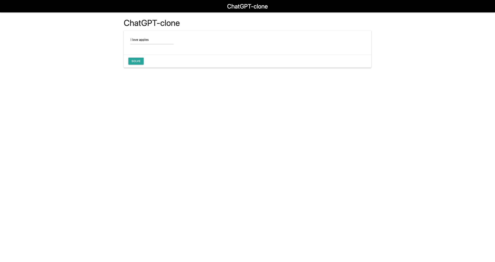

# ChatGPT-clone


ChatGPT-clone is a powerful language model trained to understand and respond to human language. It can be used for a variety of applications such as chatbots, automated customer service, language translation, and more. With its advanced natural language processing capabilities, ChatGPT-clone can understand and respond to complex questions, generate human-like text, and improve user engagement. It is easy to integrate into existing systems and can be fine-tuned to specific industries and use cases.



# DataSet
(This project was part of a project I did at the university of Minnesota)

The project gutenberg data was extracted using 

https://github.com/pgcorpus/gutenberg

This file contains the entire project gutenberg corpus (alltext) and a 10,000,000 word subset of it (smalltext), each divided into an 80-10-10 training validation test split.

The data has been lightly preprocessed to separate punctuation from words and to remove blank lines.

ls |sort -R |cat * | sed '/^[[:space:]]*$/d' | sed -E 's/([[:punct:]])+/ \1 /g'   > alltext


original gutenberg files (24,089 of them)

wc *.txt

209135776  1704216766 10835806623 total

after pre-processing

wc alltext

170359408  2123123908 11439287223 alltext

The first 10,000,000 lines of alltext was made into smalltext which was then divided into an 80-10-10 split

data/smalltext$ wc *

  1000000  12754923  67501423 smalltext.test.txt

  8000000 102578535 527775260 smalltext.train.txt

  1000000  12750958  66439281 smalltext.valid.txt

 10000000 128084416 661715964 total


# Setup

1. Create a folder called data in the project directory and place the data inside the folder (for more details see datasets section)

2. Create a virtualenv and activate it 
```
python3 -m virtualenv env
```
```
source env/bin/activate
```

3. Install the dependencies
```
pip install -r requirements.txt
```

4. Train the model 
```
python generator/utils.py
```

5. Run the project
```
python manage.py runserver
```

6. Go to `localhost:8000` and have fun!
